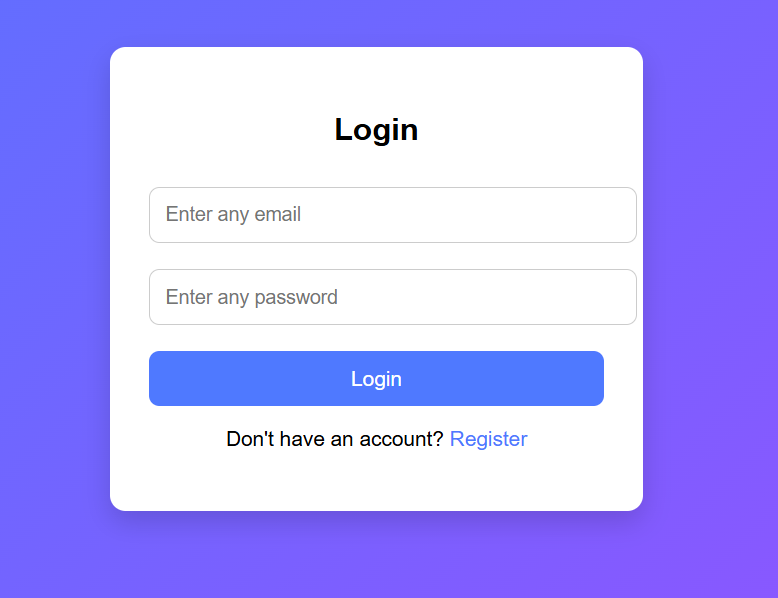
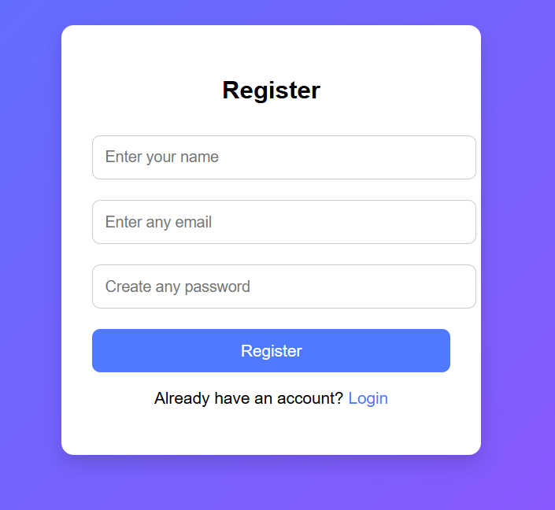

# Simple Authentication System

A clean, modern, and beginner-friendly **Simple Authentication UI System** built using **HTML**, **CSS**, and **JavaScript**.  
This project demonstrates the core structure of a login/register flow with smooth UI transitions, validation alerts, and success screens — all without a backend.

---

## Key Features

- **User Registration Page** – Name, Email & Password inputs with validation.  
- **Login Page** – Simple email + password login system.  
- **Success Screens** – Beautiful confirmation UI for both registration and login.  
- **Smooth UI Transitions** – Pages appear and hide seamlessly using JavaScript.  
- **Gradient Background** – Modern linear-gradient theme.  
- **No Backend Required** – Works completely on frontend (JavaScript only).

---

## Technologies Used

| Technology | Description |
|-----------|-------------|
| **HTML5** | Builds the structure and pages for login/register UI |
| **CSS3** | Handles design, layout, gradients, and responsiveness |
| **JavaScript (Vanilla)** | Controls page switching, validation, and success messages |

---

## Project Highlights

- Clean and simple **auth card design** with rounded corners.  
- Easy navigation between Login ↔ Register.  
- Minimalistic UI suitable for beginners and portfolio projects.  
- Uses a **single HTML file** with multiple sections shown/hidden dynamically.  
- Fully responsive layout for mobile and desktop.

---

## Preview

  
  

---

## Project Links

- **Live Demo:** [site](https://simple-authentication-system-login.netlify.app/)

---
## Learning Experience

This project helped me understand:

- Switching between multiple screens using JavaScript  
- DOM manipulation (`style.display`)  
- Basic UI validation alerts  
- Designing simple card-style interfaces  
- Working with gradients and clean layouts  
- Building beginner-friendly authentication UI logic  

---

## Future Enhancements

- Add **localStorage** to store registered users  
- Create a complete **real authentication** using backend (Firebase / Node.js)  
- Add password visibility toggle  
- Add form validation styling  
- Add animations for page transitions  
- Add forgot password UI  

---

## Details

**Author:** [Dinesh Babu R S](https://github.com/Dineshbaburs)  
**Project:** Simple Authentication System 
**Category:** Web Development and Designing
