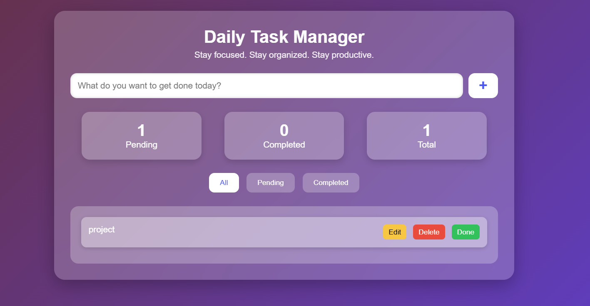

# Daily Task Manager

A clean, modern, and highly interactive **Daily Task Manager Web App** built using **HTML**, **CSS**, and **JavaScript**.  
This application helps users stay organized and productive with real-time task tracking, smart filters, and a visually appealing glassmorphism UI.

---

## Key Features

- **Add & Delete Tasks** – Simple and fast task creation and removal.  
- **Edit Tasks** – Update existing tasks with a single click.  
- **Mark as Completed** – Toggle between completed and pending states.  
- **Smart Filtering Tabs** – Switch between **All**, **Pending**, and **Completed** tasks.  
- **Live Task Statistics** – Auto-updates **Pending**, **Completed**, and **Total** task counters.  
- **Glassmorphism UI** – Modern transparent design with soft shadows and gradients.  
- **Fully Responsive** – Smooth experience on mobile, tablet, and desktop.

---

## Technologies Used

| Technology | Purpose |
|-----------|---------|
| **HTML5** | Defines the structural layout of the app |
| **CSS3 (Glassmorphism)** | Modern UI design, styling, and responsiveness |
| **JavaScript (ES6)** | Handles task logic, filtering, CRUD operations, and DOM updates |

---

## Project Highlights

- Beautiful **glass-effect card layout** with smooth blur and glow.  
- Real-time task updates with dynamic counters.  
- Intuitive UI layout for productivity and ease of use.  
- Cleanly separated code for easy understanding and modification.  
- Mobile-friendly design with flexible sizing and spacing.  

---

## Preview

---

## Project Links

- **Live Demo:** [site](https://to-do-task-webapp.netlify.app/)

---

## Learning Experience

Throughout this project, I strengthened my skills in:

- DOM manipulation & element creation  
- Working with arrays to store and modify objects  
- Building full CRUD functionality in the frontend  
- Designing **glassmorphism** UI with gradients and blur effects  
- Writing cleaner, more modular JavaScript  
- Improving responsive design using Flexbox  

This project enhanced both my **frontend development** and **UI/UX design** abilities.

---

## Future Enhancements

- Add **LocalStorage** to save tasks permanently  
- Add **Dark / Light mode toggle**  
- Add **Task categories** (Personal, Work, Urgent)  
- Add **animations** when adding/removing tasks**  
- Add **drag-and-drop task sorting**  
- Add voice-to-task or reminders feature  

---

## Author

[Dinesh Babu R S](https://github.com/Dineshbaburs)  
**Project:** Daily Task Manager  
**Category:** Web Development & Designing
